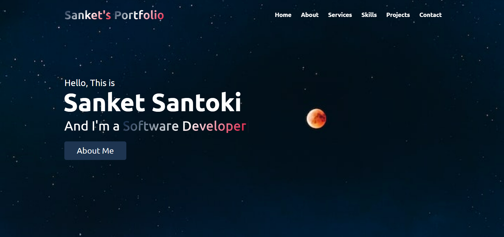

# BharatIntern_Portfolio
Welcome to my Software Engineer Portfolio, a project completed as part of my internship with BharatIntern.

Sanket's Portfolio [Live Demo here](https://sanket-santoki.github.io/BharatIntern_Portfolio/)

Github Profile [link](https://github.com/sanket-santoki/)

 

# Overview
This portfolio showcases my skills, projects, and experiences as a software engineer. Crafted using HTML, CSS, Bootstrap, and JavaScript for a responsive and interactive design.

# Features
Responsive Design: Ensures optimal viewing experience across devices.
Bootstrap Integration: Utilizes Bootstrap for a modern and sleek UI.
Interactive Elements: Incorporates JavaScript for engaging user interactions.
Project Showcase: Explore my coding projects with detailed descriptions.

# Task Details
This project is a result of my internship with BharatIntern (Task-1). It reflects my commitment to continuous learning and hands-on application of web development skills.

# Technologies Used:
HTML
CSS
Bootstrap
JavaScript

# Credits:
Developed by Sanket Santoki
Internship at BharatIntern

Feel free to reach out for any questions or feedback. Thank you for visiting! 🚀
